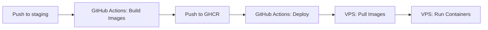

# 🐳 Registry-Based Deployment Setup

## Overview

This deployment strategy builds Docker images on **GitHub Actions** (which has more resources) and pushes them to **GitHub Container Registry (GHCR)**. Your VPS then simply pulls and runs the pre-built images. This is the **recommended approach for low-resource servers**.

## ✅ Benefits

- ✅ **No build on VPS** - Saves CPU and memory on your 2GB RAM server
- ✅ **Faster deployments** - Just pull and run pre-built images
- ✅ **Consistent builds** - All images built in the same environment
- ✅ **Better caching** - GitHub Actions caches layers efficiently
- ✅ **No memory issues** - Build happens on GitHub's infrastructure

## 🔄 How It Works



1. **Build Workflow** (`.github/workflows/build-and-push-images.yml`):
   - Triggers on push to `staging` or `main`
   - Builds backend and frontend Docker images
   - Pushes images to `ghcr.io/<your-repo>/backend:staging` and `ghcr.io/<your-repo>/frontend:staging`

2. **Deploy Workflow** (`.github/workflows/deploy-staging.yml`):
   - Triggers on push to `staging`
   - Authenticates with GHCR
   - Pulls pre-built images
   - Runs `docker compose up -d` (no build!)

## 🔐 Required GitHub Secrets

### For Building Images (Automatic)
- ✅ `GITHUB_TOKEN` - Automatically provided by GitHub Actions (no setup needed)
- ✅ Works for public repositories
- ⚠️ For **private repositories**, you need a Personal Access Token (PAT)

### For Pulling Images on VPS (Optional but Recommended)
If your repository is **private**, add this secret:

| Secret Name | Description | How to Create |
|------------|-------------|---------------|
| `GHCR_TOKEN` | Personal Access Token with `read:packages` permission | See below |

### Creating a Personal Access Token (PAT)

1. Go to **GitHub** → **Settings** → **Developer settings** → **Personal access tokens** → **Tokens (classic)**
2. Click **Generate new token (classic)**
3. Name: `GHCR Deploy Token`
4. Select scopes:
   - ✅ `read:packages` (to pull images)
   - ✅ `write:packages` (if you want to push from local)
5. Click **Generate token**
6. Copy the token and add it as `GHCR_TOKEN` secret in your repository

## 📋 Setup Steps

### Step 1: Verify Workflow Files

Make sure these files exist:
```
.github/workflows/
├── build-and-push-images.yml  ✅ Builds and pushes images
└── deploy-staging.yml        ✅ Pulls and deploys images
```

### Step 2: Configure Image Names

The workflows use your repository name automatically. If your repo is `username/damirco`, images will be:
- `ghcr.io/username/damirco-backend:staging`
- `ghcr.io/username/damirco-frontend:staging`

### Step 3: First Deployment

1. **Push to staging branch:**
   ```bash
   git checkout staging
   git push origin staging
   ```

2. **Monitor workflows:**
   - Go to **GitHub** → **Actions**
   - Watch "Build and Push Docker Images" workflow
   - Wait for it to complete
   - Then "Deploy Staging" workflow will run

3. **Verify images:**
   - Go to **GitHub** → **Packages**
   - You should see `damirco-backend` and `damirco-frontend` packages

### Step 4: Verify Deployment

SSH into your VPS and check:
```bash
ssh root@185.208.172.76
cd /root/indexo-staging
docker compose -f docker-compose.staging.yml ps
docker compose -f docker-compose.staging.yml logs -f
```

## 🔍 Troubleshooting

### Issue: "Failed to pull images"

**Solution:**
1. Check if images exist: Go to **GitHub** → **Packages**
2. Verify authentication: Check `GHCR_TOKEN` secret is set
3. Check image names match in `docker-compose.staging.yml`

### Issue: "Build workflow not running"

**Solution:**
1. Check workflow file exists: `.github/workflows/build-and-push-images.yml`
2. Verify branch name matches: `staging` or `main`
3. Check GitHub Actions permissions in repository settings

### Issue: "Authentication failed"

**Solution:**
1. For **public repos**: `GITHUB_TOKEN` should work automatically
2. For **private repos**: Create PAT with `read:packages` and add as `GHCR_TOKEN` secret

### Issue: "Image not found"

**Solution:**
1. Make sure build workflow completed successfully
2. Check image tags match:
   - Build workflow creates: `ghcr.io/<repo>-backend:staging`
   - docker-compose expects: `${DOCKER_REGISTRY}/${DOCKER_REPO}-backend:${IMAGE_TAG}`
3. Verify `.env.staging` has correct `DOCKER_REGISTRY`, `DOCKER_REPO`, and `IMAGE_TAG`

## 📝 Environment Variables

The deployment workflow automatically sets these in `.env.staging`:

```bash
DOCKER_REGISTRY=ghcr.io
DOCKER_REPO=<your-github-username>/<your-repo>
IMAGE_TAG=staging
```

These are used by `docker-compose.staging.yml` to construct image names.

## 🚀 Workflow Order

When you push to `staging`:

1. **Build workflow** runs first (builds and pushes images)
2. **Deploy workflow** runs (pulls and deploys images)

If deploy runs before build completes, it will fail. You can:
- Wait for build to complete manually
- Or add workflow dependencies (future enhancement)

## 📊 Monitoring

### Check Build Status
```bash
# GitHub Actions
https://github.com/<your-username>/<your-repo>/actions
```

### Check Images
```bash
# GitHub Packages
https://github.com/<your-username>/<your-repo>/pkgs/container
```

### Check Deployment
```bash
# On VPS
docker compose -f docker-compose.staging.yml ps
docker compose -f docker-compose.staging.yml logs -f backend
docker compose -f docker-compose.staging.yml logs -f frontend
```

## 🎯 Next Steps

1. ✅ Push to `staging` branch
2. ✅ Monitor build workflow
3. ✅ Monitor deploy workflow
4. ✅ Verify services are running
5. ✅ Test your staging environment

## 📚 Related Documentation

- [Low Memory Build Fix](./LOW_MEMORY_BUILD_FIX.md) - Original memory optimization guide
- [Staging Deployment Setup](./STAGING_DEPLOYMENT_SETUP.md) - General staging setup
- [GitHub Actions Setup](./GITHUB_ACTIONS_SETUP.md) - General CI/CD setup

